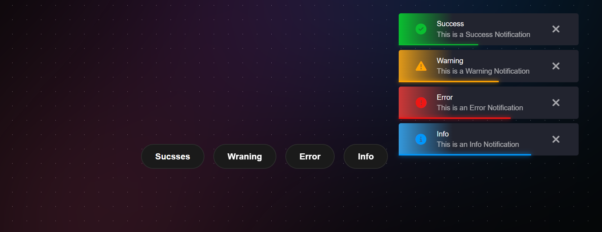

# Notification System Project

This project is a simple notification system built using HTML, CSS, and JavaScript. It allows users to trigger different types of notifications (Success, Warning, Error, Info) with corresponding icons and messages. Each notification plays a sound when triggered and automatically disappears after a few seconds.

## Features

- Displays different types of notifications (Success, Warning, Error, Info).
- Each notification includes an icon and a message.
- Notifications automatically disappear after 5 seconds.
- Users can manually close notifications by clicking the close button.
- A sound is played when a notification is triggered.

## How It Works

- Users click on one of the buttons (Success, Warning, Error, Info) to trigger the corresponding notification.
- The notification appears with a unique style and icon based on its type.
- The notification sound plays as the notification is displayed.
- The notification will automatically disappear after 5 seconds or can be closed manually by clicking the close button.

## Screenshot

## Technologies Used

- **HTML**: For the structure of the notification elements.
- **CSS**: For styling the notifications with different colors and icons.
- **JavaScript**: For handling the click events, displaying notifications, and managing the sound effects.
